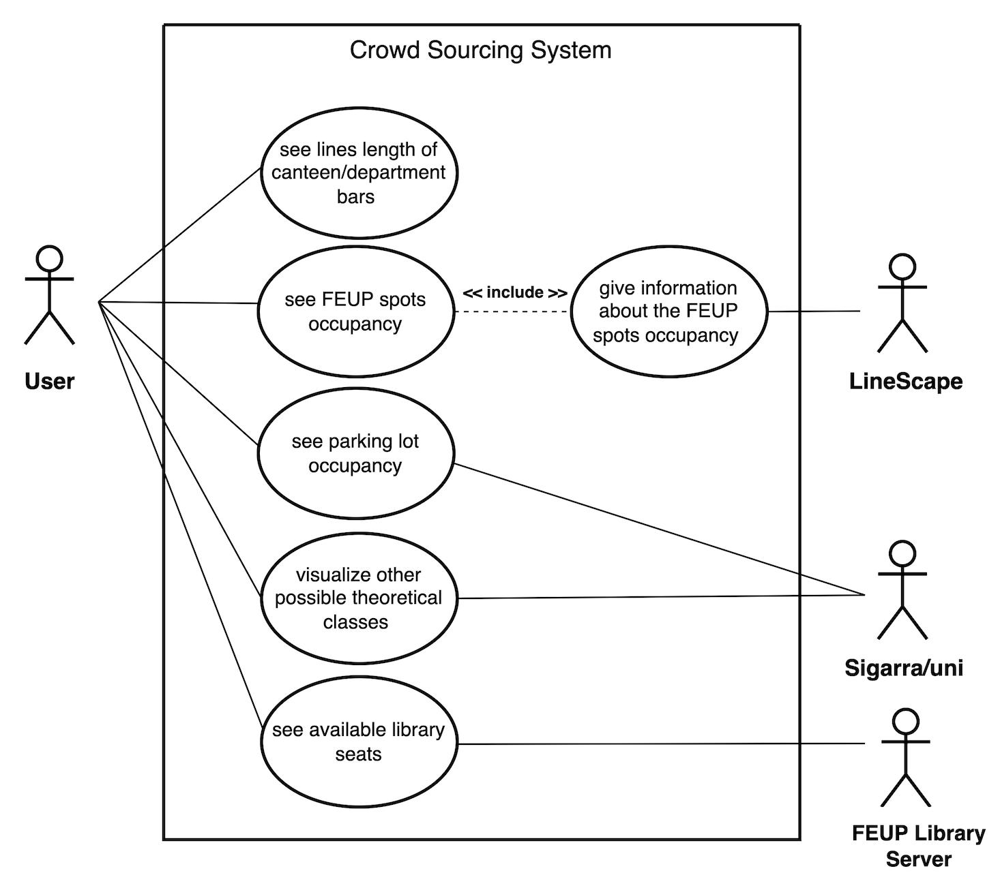

# Requirements

## Use case diagram

### See line length of canteen/department bars
|||
| --- | --- |
|**Actor**|User|
|**Description**|The user sees the line length of canteen/department bars around FEUP so they can manage their time better and see the best scheduling options.|
|**Preconditions**| The user must be logged in with FEUP credentials. |
|**Postconditions**| - The user is informed about any opening schedule even if the services are closed. |
|**Normal Flow**| **1. System:** Shows various FEUP spots options.   **2. User:** clicks on the canteen/department bars option.   **3. System:** Shows in percentage bar how much the space is occupied. Also shows the best hours to go to certain spots.|
|**Alternative Flows and Exceptions**| **[Closed Service]** If the canteen/department bars is off schedule, the app releases a warning giving information about the opening hours.

### See FEUP spots capacity
|||
| --- | --- |
|**Actor**|User|
|**Description**|The user sees the capacity of different spots around FEUP so they can avoid wasting time. |
|**Preconditions**| -The user must be logged in with FEUP credentials.|
|**Postconditions**| - The user is informed about any opening schedule even if the services are closed. | 
|**Normal Flow**| **1. System:** Shows various FEUP spots options.   **2. User:** clicks on the wanted spot option.   **3. System:** Shows in a percentage bar how much of the space is occupied. Also shows the best hours to go to certain spots.|
|**Alternative Flows and Exceptions**| **[Closed Service]** If the service is off schedule, the app releases a warning giving information about the opening hours.

### See parking lot capacity
|||
| --- | --- |
|**Actor**| User|
|**Description**| The user uses the apps feature to see the parking lots capacity to know how full/empty it is.
|**Preconditions**| - The user must be logged in with FEUP credentials. |
|**Postconditions**| - The user is informed about any opening schedule even if the services are closed.  |
|**Normal Flow**| **1. System:** Shows various FEUP spots options.   **2. User:** clicks on the parking lot option.  **3. System:** Either shows it has available spots and the number or it shows it has no available spots.
|**Alternative Flows and Exceptions**| **[Closed Service]** If the parking lot is closed, the app releases a warning giving information about the opening hours.

### Visualize other possible theoretical classes
|||
| --- | --- |
|**Actor**|User|
|**Description**|The user can see their schedule on the app, and visualize/try other theoretical classes, so they can manage their time better.|
|**Preconditions**| - The user must be logged in with FEUP credentials. |
|**Postconditions**| - The user is informed about any opening schedule even if the services are closed. |
|**Normal Flow**| **1. System:** Shows schedule option.   **2. User:** clicks on the canteen/department bars options.   **3. System:** Shows in a percentage bar how much the space is occupied. Also shows the best times to go to certain spots.|
|**Alternative Flows and Exceptions**|**[Overlapped Classes]** Shows you options for theoretical classes and warns you if classes are overlapped.|

### See available library seats
|||
| --- | --- |
|**Actor**|  User | 
|**Description** | The user uses the apps feature to see the libraries capacity to better know how full/empty it is, breaking that data into each library floor.|
|**Preconditions**| - The user must be logged in with FEUP credentials. |
|**Postconditions** |- The user is informed about any opening schedule even if the services are closed. |
| **Normal flow** | **1.** The user accesses the application through the mobile phone .  **2.** The system shows the list of services available by category.  **3.** The user selects the service.  **4.** The user can contribute for lotation and/or line statistics .  **5.** If one line or service is full, suggest other options in the same category to the user.   **6.** The user can log out the application. |
| **Alternative Flows and Exceptions** | **[Closed Service]** If the library is off schedule, the app releases a warning giving information about the opening hours. |

## Domain Model

